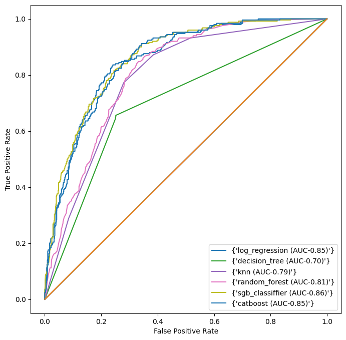

<div align="center">
  <h1><b>Telco Customer Churn Prediction</b></h1>
</div>

<!-- TABLE OF CONTENTS -->

# 📗 Table of Contents

- [📗 Table of Contents](#-table-of-contents)
- [Project Description ](#Churn-Insight-)
  - [🛠 Built with ](#-built-with-)
    - [Tech Stack ](#tech-stack-)
  - [Key Insights ](#key-features-)
  - [💻 Getting Started ](#-getting-started-)
    - [Prerequisites](#prerequisites)
    - [Setup](#setup)
  - [👥 Authors ](#-authors-)
  - [🤝 Contributing ](#-contributing-)
  - [⭐️ Show your support ](#️-show-your-support-)
  - [🙏 Acknowledgments ](#-acknowledgments-)
  - [📝 License ](#-license-)

<!-- PROJECT DESCRIPTION -->

# Customer Churn Prediction <a name="about-project"></a>

**# Churn Predictor: Forecasting Customer Churn with Machine Learning**

In the quest to boost profit and revenue margins, companies prioritize customer retention. In the modern landscape of machine learning, businesses often leverage classification models to conduct churn analysis, a crucial aspect of customer management. 


1. **CustomerID**: Unique Identifier of customer
2. **Gender**: Whether the customer is a male or a female
3. **SeniorCitizen**: Whether a customer is a senior citizen or not
4. **Partner**:Whether the customer has a partner or not (Yes, No)
5. **Dependents**: Whether the customer has dependents or not (Yes, No) 
6. **Tenure**:  Number of months the customer has stayed with the company
7. **Phone Service**:  Whether the customer has a phone service or not (Yes, No)
8. **MultipleLines**:  Whether the customer has multiple lines or not
9. **InternetService**: Customer's internet service provider (DSL, Fiber Optic, No)
10. **OnlineSecurity**:  Whether the customer has online security or not (Yes, No, No Internet)
11. **OnlineBackup**: Whether the customer has online backup or not (Yes, No, No Internet)
12. **DeviceProtection**: Whether the customer has device protection or not (Yes, No, No internet service)
12. **TechSupport**:Whether the customer has tech support or not (Yes, No, No internet)
13. **StreamingTV**: Whether the customer has streaming TV or not (Yes, No, No internet service)
14. **StreamingMovies**:  Whether the customer has streaming movies or not (Yes, No, No Internet service)
15. **Contract**:  The contract term of the customer (Month-to-Month, One year, Two year)
16. **PaperlessBilling**:Whether the customer has paperless billing or not (Yes, No)
17. **MonthlyCharges**:  The amount charged to the customer monthly
18. **PaymentMethod**:The customer's payment method (Electronic check, Mailed check, Bank transfer(automatic), Credit card(automatic))
19. **TotalCharges**: The total amount charged to the customer
20. **Churn**: Whether the customer churned or not (Yes or No).


## 🛠 Built With <a name="Technologies Used"></a>

The Telco Churn Classification Project adhered to the CRISP-DM process and leveraged various technologies, programming languages, and libraries for data processing, analysis, and visualization. The key tools utilized in this project include:

1. **Python**: Python served as the primary programming language for the project, providing robust capabilities for data manipulation, analysis, and visualization tasks.
2. **Pandas and NumPy**: These libraries were instrumental for data manipulation and numerical computations, offering efficient methods for handling datasets.
3. **Matplotlib and Seaborn**: Matplotlib and Seaborn were employed for data visualization, enabling the creation of insightful charts and graphs to represent the findings derived from the analysis.
4. **Visual Studio Code and Jupyter Notebooks**: Visual Studio Code and Jupyter Notebooks provided an interactive environment for running code, visualizing data, and documenting the analysis process. These tools facilitated seamless collaboration and experimentation.
5. **Scikit-learn**: Scikit-learn's library, specifically SimpleImputer, was utilized for imputing null values in the dataset, enhancing data quality and integrity.
6. **SQL**: Structured Query Language (SQL) was employed for database querying and data retrieval when necessary, enabling efficient access to relevant data sources.
7. **GitHub**: GitHub served as the version control system for the project, enabling collaborative development and tracking changes in the codebase. It facilitated seamless integration and versioning of project files and resources.

These technologies collectively played a pivotal role in the successful implementation of the project, providing the necessary tools and resources to analyze and derive insights from the Telco Churn dataset. 

<details>
  <summary>Data Sources</summary>
  <p>The Telco Churn dataset was sourced from three different repositories. The first 3000 records were stored in a remote database, accessed using the pyodc package. The second set of 2000 records was obtained from a file named “Telco-churn-second-2000.xlsx”, available on OneDrive. Finally, the last component, comprising 2000 records, was stored in a CSV file named “LP2_Telco-churn-last-2000.csv” on GitHub. These datasets were consolidated into a single dataset, train_df, for model training and evaluation purposes.</p>
</details>
<details>
<summary>Database</summary>
  <ul>
    <li><a href="">Microsoft SQL Server</a></li>
  </ul>
</details>

<details>
<summary>Language</summary>
  <ul>
    <li><a href="">Python</a></li>
  </ul>
</details>


<p align="right">(<a href="#readme-top">back to top</a>)</p>
<!-- Features -->

## Success Criteria <a name="key-features"></a>

To evaluate the effectiveness of the churn prediction model and associated retention strategies, the following success criteria have been established:

1. **Model Accuracy**: The model's accuracy should surpass the threshold of 70%, ensuring reliable predictions of customer churn.

2. **Retention Strategy Effectiveness**: Implemented retention strategies should demonstrate a measurable impact on reducing customer churn rates. This can be assessed by comparing churn rates before and after implementing the strategies.

3. **Cost Reduction**: The churn prediction model should contribute to reducing the costs associated with customer acquisition by identifying at-risk customers early on. This allows for targeted retention efforts, minimizing the need for costly reacquisition of lost customers.

4. **Customer Satisfaction**: While the primary focus is on retention, the model and associated strategies should also aim to maintain or improve customer satisfaction levels. High customer satisfaction leads to increased loyalty and potentially higher customer lifetime value.

5. **Adaptability and Scalability**: The developed churn prediction model should be adaptable to changing business environments and scalable to accommodate larger datasets or additional features. This ensures its long-term viability and usefulness for the company, even as the business evolves.

6. **Feedback and Iteration**: Continuous feedback loops should be established to gather insights from the model's predictions and refine the retention strategies accordingly. This iterative process ensures ongoing improvement and optimization of the churn prediction system, leading to better outcomes over time.

## Key Insights <a name="key-Insights"></a>

Based on the analysis, the following key insights have been distilled, along with corresponding recommendations:

1. **Tailor Pricing Strategies**: Higher monthly charges correlate with increased customer churn. To mitigate churn, Vodafone could explore tailored pricing strategies that balance revenue generation with customer satisfaction and perceived value.

2. **Enhance Early Customer Experience**: Elevated churn rates during the initial months underscore the importance of prioritizing early customer experience. By focusing on seamless onboarding processes, service quality, and swift issue resolution, Vodafone can enhance satisfaction and foster loyalty during this critical phase.

3. **Promote Long-Term Contracts**: Month-to-month contracts exhibit higher churn rates, indicating the need to encourage the adoption of longer-term contracts through incentives and benefits. This approach fosters commitment and diminishes churn among customers.

4. **Leverage Additional Services**: Services like Online Security and Backup significantly impact churn rates. Strengthening these offerings to address customer needs can aid in retention by delivering value-added solutions.

5. **Monitor Fiber Optic Offering**: The Fiber Optic service, despite its high charges, experiences notable churn rates. Meticulous attention to refining and supporting this service ensures that premium costs align with customer expectations, minimizing churn.

6. **Personalized Customer Engagement**: Insights from churn analysis can inform personalized engagement strategies. Tailored communication, targeted offers, and customized marketing campaigns based on factors such as tenure, contract type, and preferences can enhance loyalty and mitigate churn effectively.

<p align="right">(<a href="#readme-top">back to top</a>)</p>


<!-- GETTING STARTED -->

## 💻 Getting Started <a name="getting-started"></a>


To get a local copy up and running, follow these steps.

### Prerequisites

In order to run this project you need:

- Python


### Setup

Clone this repository to your desired folder:


```sh
  cd my-folder
  git clone https://github.com/parockson/churn-analysis-with-machine-learning.git
```

Change into the cloned repository

```sh
  cd Indian_Startup_Ecosystem_Analysis_2018-2021
  
```

Create a virtual environment

```sh

python -m venv env

```

Activate the virtual environment

```sh
    env/Scripts/activate
```


### Install

Here, you need to recursively install the packages in the `requirements.txt` file using the command below 

```sh
   pip install -r requirements.txt
```


<!-- AUTHORS -->

## 👥 Authors <a name="authors"></a>

🕵🏽‍♀️ **Prince Acquah Rockson**

- GitHub: [GitHub Profile](https://github.com/parockson)
- LinkedIn: [LinkedIn Profile](www.linkedin.com/in/prince-acquah-rockson)

<p align="right">(<a href="#readme-top">back to top</a>)</p>


## 🤝 Contributing <a name="contributing"></a>

We welcome contributions, feedback, and suggestions for improvement! If you encounter any issues or have ideas for enhancing this project, please feel free to raise them on the [issues page](../../issues/).

<p align="right">(<a href="#readme-top">back to top</a>)</p>

<!-- SUPPORT -->

## ⭐️ Show your support <a name="support"></a>

If you find this project helpful or valuable, please consider showing your support by giving it a ⭐️ star on GitHub!

<p align="right">(<a href="#readme-top">back to top</a>)</p>

<!-- ACKNOWLEDGEMENTS -->

## 🙏 Acknowledgments <a name="acknowledgements"></a>

We would like to express our sincere gratitude to our instructors, Racheal Appiah-Kubi and Violette Naa Adoley Allotey, for their exceptional guidance, unwavering support, and invaluable mentorship throughout the duration of this project. Their expertise, dedication, and commitment to our learning journey have been instrumental in shaping our understanding and skills in data analysis.

A special thank you also goes to Foster Nana Kwabena for his valuable advice and insights shared during the development of this project. His experiences and expertise in similar projects have been a source of inspiration and guidance, enriching our project with practical knowledge.

<p align="right">(<a href="#readme-top">back to top</a>)</p>


<p align="right">(<a href="#readme-top">back to top</a>)</p>

<!-- LICENSE -->

## 📝 License <a name="license"></a>

This project is [MIT](./LICENSE) licensed.

<p align="right">(<a href="#readme-top">back to top</a>)</p>

<p> align="right">(<a href="https://medium.com/@parockson">Link to Article</a>)</p>


